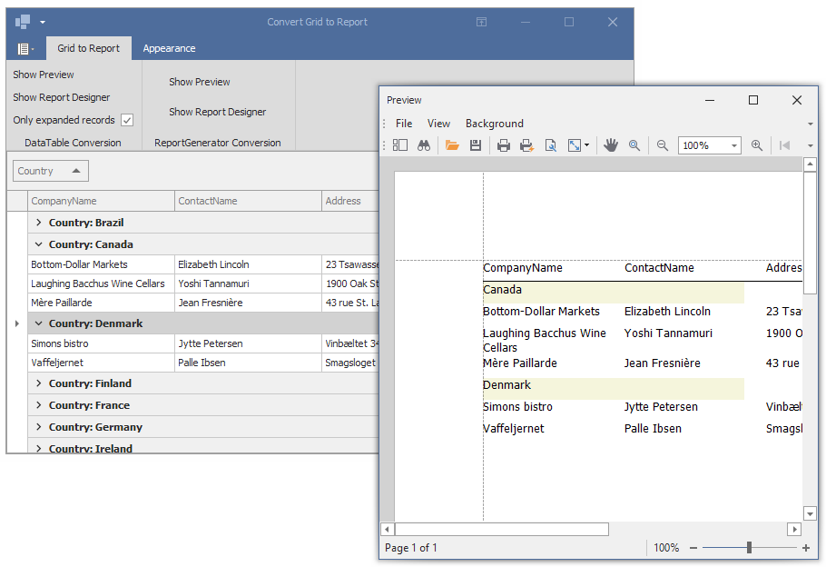

# Reporting for WinForms - Create a Report from the DevExpress GridControl 

This example creates a report that mimics the [GridControl](https://docs.devexpress.com/WindowsForms/DevExpress.XtraGrid.GridControl) data display, invokes the report preview, and loads the report in the Report Designer. Two ribbon pages are related to different ways to create a report.

The **DataTable Conversion** page buttons call methods that use the intermediate DataTable.
If the **Only expanded rows** box is unchecked, the report displays all data from the GridControl's data source.
If the **Only expanded rows** box is selected, the report displays data from visible rows in the GridControl.

The **Report Generator Conversion** page commands use the ReportGenerator class from the Reporting Extensions library that ships with the DevExpress installation. 

The data source is the SQLite database with Northwind data.

## DataTable Method

The [GridView.GetVisibleRowHandle](https://docs.devexpress.com/WindowsForms/DevExpress.XtraGrid.Views.Grid.GridView.GetVisibleRowHandle(System.Int32)) method is used to get visible data rows. A [DataTable](https://docs.microsoft.com/en-us/dotnet/api/system.data.datatable) is created and passed to the report constructor in the code-behind file. The report constructor uses the GridView to create a report layout at runtime. The grid column captions compose the [XRTable](https://docs.devexpress.com/XtraReports/DevExpress.XtraReports.UI.XRTable) structure. Grouped columns in the grid produce  the [GroupHeaderBand](https://docs.devexpress.com/XtraReports/DevExpress.XtraReports.UI.GroupHeaderBand) in the report.

## ReportGenerator Method 

The [ReportGenerator.GenerateReport](https://docs.devexpress.com/XtraReports/DevExpress.XtraReports.ReportGeneration.ReportGenerator.GenerateReport.overloads) method creates a report from the [GridView](https://docs.devexpress.com/WindowsForms/DevExpress.XtraGrid.Views.Grid.GridView) and allows you to specify the 
[report generation options](https://docs.devexpress.com/CoreLibraries/DevExpress.XtraReports.ReportGeneration.ReportGenerationOptions._members).

 
<!-- default file list -->

## Files to Look At

* [Form1.cs](CS/ConvertGridToReportExample/Form1.cs) (VB: [Form1.vb](VB/ConvertGridToReportExample/Form1.vb))
* [XtraReport1.cs](CS/ConvertGridToReportExample/XtraReport1.cs) (VB: [XtraReport1.vb](VB/ConvertGridToReportExample/XtraReport1.vb))

<!-- default file list end -->

## Documentation

- [Convert DevExpress Data Grid to Report](https://docs.devexpress.com/XtraReports/119218/get-started-with-devexpress-reporting/convert-a-devexpress-data-grid-to-a-report)
- [Advanced Grid Printing and Exporting](https://docs.devexpress.com/WindowsForms/114962/controls-and-libraries/data-grid/export-and-printing/advanced-grid-printing-and-exporting)
- [Generate a Grid-Based Report (WPF)](https://docs.devexpress.com/WPF/117300/controls-and-libraries/data-grid/printing-and-exporting/grid-based-report-generation)

